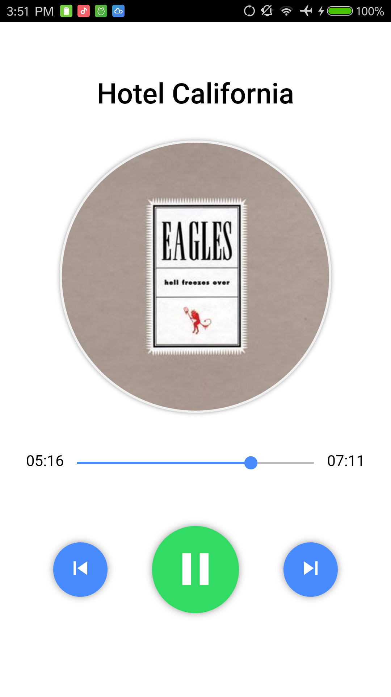

# ionic-audio-player

This is a simple audio player created with Ionic 3.x / Angular 4.x

It features a **play/pause** button, **skip back/forward** buttons and a **progress bar** that displays the current position of the audio file. It also supports setting arbitrary positions using the **progress bar**.

## Ionic Native Plugins

- [File](https://ionicframework.com/docs/native/file/)
- [File Transfer](https://ionicframework.com/docs/native/file-transfer/)
- [Media](https://ionicframework.com/docs/native/media/)

## Support Platforms

- Android
- iOS (in development)

## UI Preview

### Android

&nbsp;&nbsp;

## Author

Created by [Michael Liu](https://lxieyang.github.io)

Last updated: July 25, 2017

